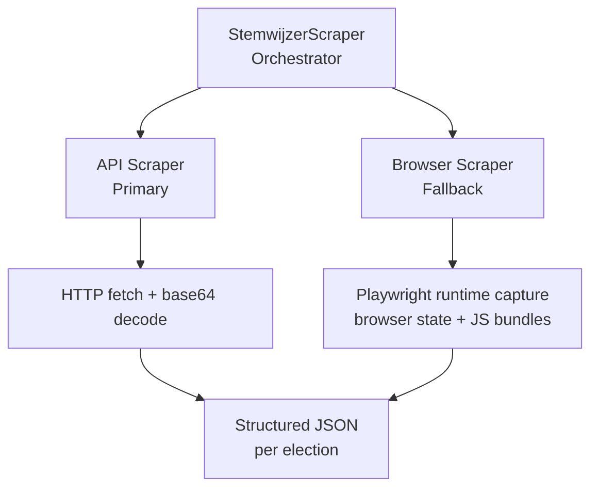

<div align="center">

# nl-voting-data-scraper

[](https://pypi.org/project/nl-voting-data-scraper/)
[](https://pypistats.org/packages/nl-voting-data-scraper)
[](https://github.com/rhnfzl/nl-voting-data-scraper/actions/workflows/check.yml)
[](https://pypi.org/project/nl-voting-data-scraper/)
[](LICENSE)

Scrape Dutch voting advice ([StemWijzer](https://stemwijzer.nl)) data across live and archived elections: municipal, national, European, or provincial.
</div>

Outputs structured JSON with party positions, policy statements, and metadata. Reusable across election cycles, including historical timeline analysis.

### Key Features

- **Hybrid scraping**: API-first (fast HTTP) with Playwright browser automation fallback
- **Historical extraction**: Works against archived StemWijzer apps when live API endpoints no longer exist
- **Multiple capture modes**: Direct API fetch, runtime `JSON.parse` capture, page-global extraction, and JS bundle parsing
- **Election-agnostic**: Municipal, national (Tweede Kamer), European Parliament, and provincial elections
- **Historical timeline ready**: Includes archived parliamentary elections back to 2006
- **CLI + Library**: Use from the command line or import in Python
- **Caching & resume**: File-based cache for interrupted batch scrapes
- **Rate limiting**: Token-bucket rate limiter with exponential backoff
- **Base64/AES decoding**: Handles encoded StemWijzer API responses automatically
- **Structured output**: Legacy flat JSON layout or engine-friendly snapshot layout for downstream apps

## Installation

```bash
pip install nl-voting-data-scraper
```

For browser automation fallback and archived elections:

```bash
pip install "nl-voting-data-scraper[browser]"
playwright install chromium
```

## Quick Start

### CLI

```bash
# List known elections
nl-voting-data-scraper list-elections

# Scrape all municipalities for 2026 municipal elections
nl-voting-data-scraper scrape gr2026 -o ./output

# Scrape a specific municipality
nl-voting-data-scraper scrape gr2026 -m GM0014 -o ./output

# Scrape a live national election
nl-voting-data-scraper scrape tk2025 -o ./output

# Scrape an archived historical election
nl-voting-data-scraper scrape tk2017 --browser-only -o ./output

# Write engine snapshots for downstream apps
nl-voting-data-scraper scrape tk2023 --layout engine -o ./snapshots

# List municipalities for an election
nl-voting-data-scraper list-municipalities gr2026

# Discover endpoints and browser capture details
nl-voting-data-scraper discover tk2021
```

### Python Library

```python
import asyncio

from nl_voting_data_scraper import StemwijzerScraper


async def main():
    async with StemwijzerScraper("tk2023") as scraper:
        results = await scraper.scrape()
        for data in results:
            print(
                f"{data.votematch.name}: "
                f"{len(data.parties)} parties, {len(data.statements)} statements"
            )

    async with StemwijzerScraper("gr2026") as scraper:
        data = await scraper.scrape_one("GM0014")
        if data:
            print(f"Municipality: {data.votematch.name}")


asyncio.run(main())
```

## Supported Elections

| Slug | Type | Year | Source mode | Notes |
|------|------|------|-------------|-------|
| `gr2026` | Municipal | 2026 | Live API + browser fallback | 258+ municipalities |
| `tk2025` | National | 2025 | Live API + browser fallback | Single national contest |
| `eu2024` | European | 2024 | Live API + browser fallback | Single national contest |
| `tk2023` | National | 2023 | Live API + browser fallback | Single national contest |
| `ps2023` | Provincial | 2023 | Live API + browser fallback | Multi-jurisdiction provincial dataset |
| `tk2021` | National | 2021 | Archived browser extraction | Wayback-backed |
| `tk2017` | National | 2017 | Archived browser extraction | Wayback-backed |
| `tk2012` | National | 2012 | Archived browser extraction | Wayback-backed |
| `tk2010` | National | 2010 | Archived browser extraction | Wayback-backed |
| `tk2006` | National | 2006 | Archived browser extraction | Wayback-backed |

Unknown election slugs still fall back to auto-detected URL patterns through the library API.

## Historical Extraction

Archived elections do not always expose the modern JSON index/data endpoints anymore. For those cases, the scraper can recover contest payloads from the frontend itself:

1. Live API fetch when a data endpoint still exists.
2. Runtime capture by intercepting `JSON.parse(...)` before the app boots.
3. Page-global extraction for older builds that expose `config`, `objectNames`, or related globals.
4. Static bundle parsing for embedded JSON, URL-encoded JSON, or base64-wrapped payloads.

For archived elections, install the `browser` extra and Chromium. `--browser-only` is the safest mode when you already know the election is archive-backed.

## How It Works



1. **API-first (fast):** Fetches data from StemWijzer data endpoints via HTTP. Handles base64-encoded responses and optional AES decryption.
2. **Browser fallback:** If the API fails or no longer exists, Playwright loads the frontend and captures usable contest payloads from runtime state, page globals, or JS bundles.
3. **Synthetic indexing for single contests:** When archived national or EU elections expose the contest but not the legacy index, the scraper generates a stable single-entry index automatically.

## Output Layouts

### Legacy layout

The default `legacy` layout matches the original package behavior:

```text
output/
  index.json
  GM0014.json
  tk2023.json
  combined.json  # optional
```

### Engine layout

Use `--layout engine` to write a reusable snapshot structure for downstream applications:

```text
output/
  tk2023/
    index.json
    manifest.json
    raw/
      tk2023.json
```

The engine layout is especially useful when another project wants to ingest scraped elections directly without any post-processing.

## Output Format

Each output entry contains structured party, statement, and contest metadata:

```json
{
  "parties": [
    {
      "id": 206919,
      "name": "Party Name",
      "fullName": "Full Party Name",
      "website": "https://...",
      "hasSeats": true,
      "statements": [
        { "id": 206987, "position": "agree", "explanation": "..." }
      ]
    }
  ],
  "statements": [
    {
      "id": 206987,
      "theme": "Housing",
      "title": "The municipality should build more affordable housing.",
      "index": 1
    }
  ],
  "shootoutStatements": [],
  "votematch": {
    "id": 206918,
    "name": "Municipality Name",
    "context": "2026GR",
    "remote_id": "GM0014",
    "langcode": "nl"
  }
}
```

## CLI Options

```text
nl-voting-data-scraper scrape ELECTION [OPTIONS]

Options:
  -m, --municipality TEXT   Specific GM codes (repeatable)
  -l, --language TEXT       Languages to scrape (default: nl)
  -o, --output TEXT         Output directory (default: ./output)
  --layout [legacy|engine]  Output layout (default: legacy)
  --combined                Also write combined.json
  --rate-limit FLOAT        Requests per second (default: 2.0)
  --no-cache                Disable caching
  --resume                  Resume interrupted scrape from cache
  --browser-only            Only use browser scraping
  --api-only                Only use API scraping
  -v, --verbose             Verbose output
```

## Development

```bash
git clone https://github.com/rhnfzl/nl-voting-data-scraper.git
cd nl-voting-data-scraper
pip install -e ".[dev,browser]"
playwright install chromium
ruff check src/ tests/
ruff format --check src/ tests/
mypy src/
pytest -v
python -m build
```

## Release

The repository publishes to PyPI from GitHub Releases:

1. Update the package version in `pyproject.toml` and `src/nl_voting_data_scraper/__init__.py`.
2. Push to `main`.
3. Create a GitHub Release such as `v0.3.0`.
4. The `publish.yml` workflow builds the package and uploads it to PyPI.

## Acknowledgements

Inspired by [afvanwoudenberg/stemwijzer](https://github.com/afvanwoudenberg/stemwijzer).

## License

This project is licensed under the MIT License. See [LICENSE](LICENSE) for details.
